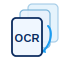

<p align="center">
  
</p>

# PDF-OCR-Converter


> 🇬🇧 **English version:** see [README.md](README.md)

Ein plattformübergreifendes Tool, das PDF-Dateien per **Adobe PDF Services
API** (OCR) in bearbeitbare DOCX-Dateien umwandelt – ausgelöst per
Rechtsklick im Dateimanager unter Linux (Nemo) und Windows (Explorer).

## Funktionen

- **Rechtsklick-Integration** unter Linux (Nemo) und Windows (Explorer)
- **OCR to DOCX** – einzelne PDF oder mehrere PDFs (einzeln verarbeitet)
- **Merge & OCR to DOCX** (nur Linux, Mehrfachauswahl) – fügt mehrere PDFs
  mit dem Quick Merge aus [Linux-PDF-Merge-in-Nemo](https://github.com/robitschmatthias-ui/Linux-PDF-Merge-in-Nemo)
  zusammen und schickt die zusammengeführte Datei zur Adobe OCR
- **Sprachauswahl-Dialog** – OCR-Sprache wählbar (tkinter)
- **Desktop-Benachrichtigungen** via `plyer`
- **Sichere Credential-Verwaltung** – Zugangsdaten werden außerhalb des
  Repos in `~/.config/pdf-ocr-converter/.env` gespeichert (nicht in git)

## Namensschema für die Ausgabedatei

Von Adobe zurückkommende Dateien erhalten immer das Suffix `_OCR`, z.B.
`rechnung.pdf` → `rechnung_OCR.docx`. Beim Zusammenführen mehrerer Dateien
übernimmt das Ergebnis den Namen der **ersten** Datei in der Auswahl.

## Voraussetzungen

- Python 3.10+
- Adobe Developer Console Account mit PDF Services API-Zugangsdaten
  (siehe [docs/adobe-credentials.md](docs/adobe-credentials.md))
- **Free-Tier:** 500 Transaktionen/Monat (~250 OCR-Konvertierungen)

## Installation

### Linux (Nemo)

```bash
git clone https://github.com/robitschmatthias-ui/PDF-OCR-Converter.git ~/scripts/pdf-ocr-converter
cd ~/scripts/pdf-ocr-converter
bash install/linux/install.sh
```

Beim ersten Aufruf öffnet sich ein Dialog zur Eingabe der Adobe-Zugangsdaten;
diese werden unter `~/.config/pdf-ocr-converter/.env` gespeichert.

### Windows (Explorer)

```powershell
git clone https://github.com/robitschmatthias-ui/PDF-OCR-Converter.git $env:LOCALAPPDATA\pdf-ocr-converter
cd $env:LOCALAPPDATA\pdf-ocr-converter
install\windows\install.ps1
```

## Nutzung

Im Kontextmenü von PDF-Dateien erscheinen drei Einträge:

| Eintrag | Verhalten |
|---|---|
| **OCR to DOCX** | Einzelne Datei oder Mehrfachauswahl (jeweils einzeln verarbeitet) |
| **Merge & OCR to DOCX** | Nur bei Mehrfachauswahl (Linux); zuerst mergen, dann OCR |
| **OCR Settings** | Adobe-Zugangsdaten neu eingeben / ändern |

## Sicherheit

- Zugangsdaten werden **außerhalb** des Projektordners gespeichert (nie commitbar)
- Temporäre Merge-Dateien werden nach der Verarbeitung sicher gelöscht
- Logs enthalten keine Credentials oder sensitiven Pfade
- Geplanter Ausbau: OS-Keychain (GNOME Keyring / Windows Credential Manager)

> **Datenschutzhinweis:** Adobe verarbeitet die Dokumente auf AWS-Servern in
> den USA (US-East) und speichert sie bis zu 24 Stunden. Bei DSGVO-sensiblen
> Dokumenten entsprechend abwägen.

## Lizenz

GPL-3.0 – siehe [LICENSE](LICENSE).

## Credits

Aufbauend auf dem [Adobe PDF Services Python SDK](https://github.com/adobe/pdfservices-python-sdk-samples)
und inspiriert von [Linux-PDF-Merge-in-Nemo](https://github.com/robitschmatthias-ui/Linux-PDF-Merge-in-Nemo).
